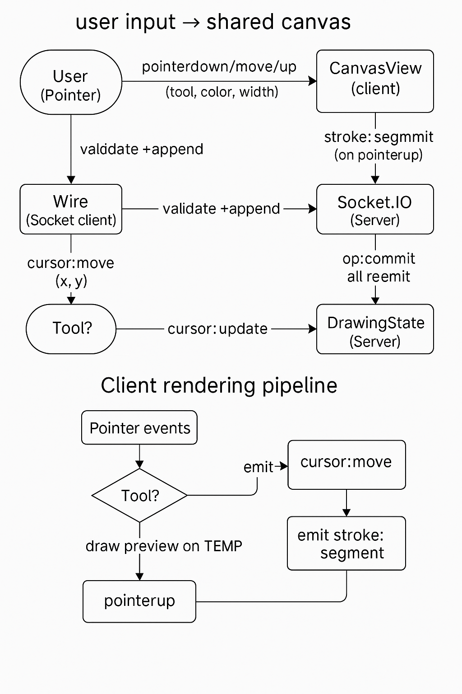

# 🏗️ Collaborative Canvas – Architecture Overview

This document describes the **system architecture** of the Collaborative Canvas web application — a real-time, multi-user drawing board built with **Vanilla JS + Socket.IO**.  
It outlines data flow, WebSocket communication, undo/redo handling, and the strategies used for maintaining performance and consistency across users.

---

## 🎨 Data Flow Diagram

The following diagram illustrates how drawing events travel from user input → shared canvas → other connected clients.

**Flow Summary:**
1. **User Input (Pointer Events):**  
   - Each pointer action (`pointerdown`, `pointermove`, `pointerup`) is captured in the client.
   - Temporary strokes are rendered locally for immediate visual feedback.

2. **Event Emission (Client → Server):**  
   - On `pointerup`, the stroke is serialized and emitted as a Socket.IO event (`stroke:segment`).

3. **Server Processing:**  
   - The server (`Socket.IO`) validates incoming data and forwards it to the `DrawingState` module.
   - The state is updated and broadcasted to all other users in the same room.

4. **Real-time Synchronization (Server → Clients):**  
   - All connected clients receive `stroke:commit` events and redraw the updated canvas in real-time.

---

## 🔌 WebSocket Protocol

| Direction | Event Name | Payload | Description |
|------------|-------------|----------|--------------|
| ⬆️ Client → Server | `stroke:segment` | `{points[], color, width, tool}` | Sent when user completes a stroke. |
| ⬇️ Server → Client | `stroke:commit` | `{id, points[], color, width}` | Broadcast to all other users for rendering. |
| ⬆️ Client → Server | `cursor:move` | `{x, y}` | Real-time pointer movement updates. |
| ⬇️ Server → Client | `cursor:update` | `{userId, x, y}` | Displays live cursors of other users. |
| ⬆️/⬇️ | `undo` / `redo` | `{opId}` | Handles global undo/redo synchronization. |

All messages are **event-based** (no polling), using Socket.IO’s acknowledgment system to ensure message delivery even under intermittent connectivity.

---

## 🔁 Undo/Redo Strategy

Undo/Redo is implemented as a **global operation stack** managed server-side:

- Each drawing action is treated as an “operation object”.
- The server maintains a **chronological stack** of operations per room.
- When a user triggers Undo:
  - The latest operation is marked “inactive” and the updated state is broadcast.
- Redo reverses this process by reactivating the next operation.
- The `DrawingState` module handles replaying the entire canvas efficiently to ensure a consistent view for all clients.

This design guarantees that Undo/Redo affects **everyone in the same session** (not just locally).

---

## ⚙️ Performance Decisions

| Optimization | Description |
|---------------|--------------|
|  **Batched Updates** | Small stroke segments are bundled before being emitted, reducing network overhead. |
|  **Temp Layer Rendering** | Real-time previews drawn on a lightweight “TEMP” layer for smoothness. |
|  **Minimal Repaint Zones** | Only affected regions of the canvas are re-rendered (not the entire frame). |
|  **Socket Compression** | Stroke data is compressed and serialized efficiently for faster transmission. |
|  **Low-Memory State Cache** | Old stroke history is pruned beyond a threshold to maintain performance. |

---

## ⚔️ Conflict Resolution

Simultaneous edits from multiple users are handled by the **DrawingState** module:

- Each stroke has a unique `operationId` and `timestamp`.  
- Server uses **last-write-wins** ordering when two users draw in overlapping regions.
- Cursor events are independent, so multiple users can see each other’s actions instantly.
- Undo operations are synchronized globally — so if User A undoes, it updates for all connected users.

This ensures the shared canvas remains **consistent, real-time, and conflict-free** even under high concurrency.

---

**Author:** Argha Banerjee  
**Project:** Collaborative Canvas (FLAM Assignment)
